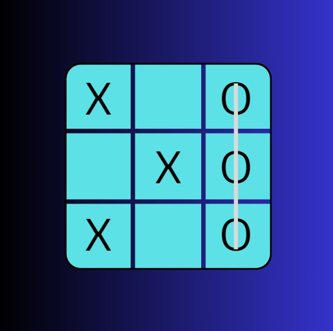

# About the Project
This site utilizes a minimax algorithm to have an Artificial Intelligence play against you in a game of TicTacToe. The logic and working of the algorithm is written in a seperate Python File and content is rendered onto the webpage via Flask, Jinja, AJAX and Javascript.

## Website Link

## Demo

## Recognition:

### Submitted to Coolest Projects 2025 (Web)

#### Feedback: 
